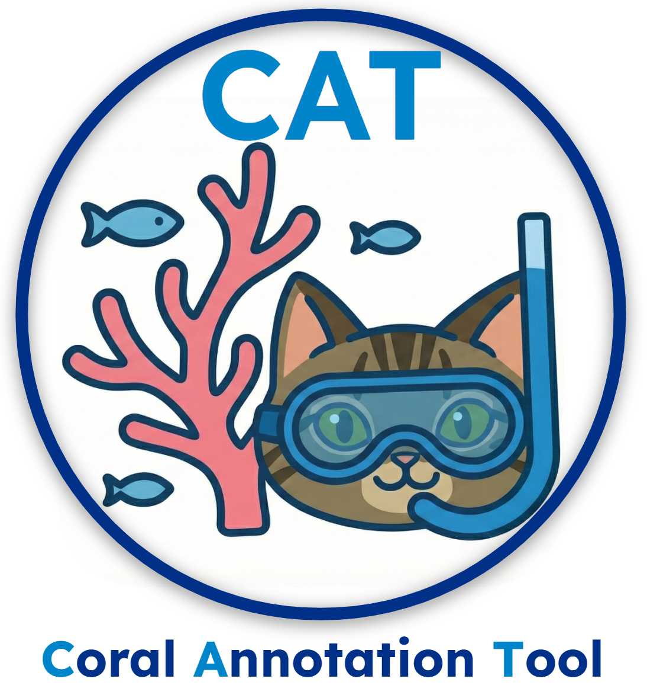
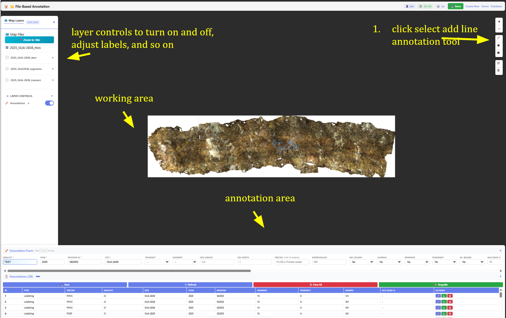
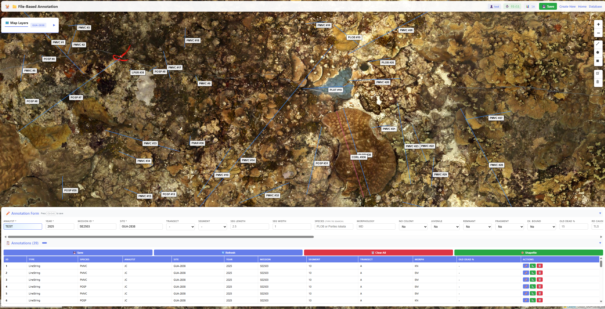
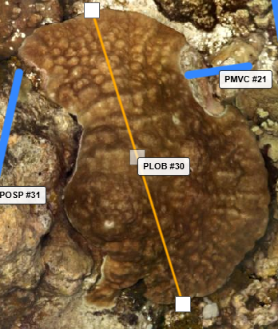

# CAT: Coral Annotation Tool
<a href="" target="_blank"></a>
  **C**oral **A**nnotation **T**ool - File-based  Structure from Motion (SfM) Orthomosaic coral reef annotation and visualization tool to support coral reef research.
### 📖 About

**CAT** is a lightweight, file-based annotation system designed specifically for marine scientists and coral reef researchers working with Structure from Motion (SfM) orthomosaic imagery. Built with modern web technologies and Cloud Optimized GeoTIFF (COG) support, CAT provides a streamlined workflow for annotating, analyzing, and managing coral reef datasets without the complexity of databases or heavy dependencies.

Perfect for field research environments where simplicity, speed, and reliability are essential.


### ✨ Features

### 🗺️ **Mapping & Visualization**
- **Fast Streaming** - Dynamic tile generation for instant viewing (ala google maps but for orthomoasics)
- **High Zoom Levels** - Zoom up to 2000x for pixel-level inspection
- **Interactive Interface** - Leaflet.js-based responsive mapping
- **Multi-Layer Support** - Work with multiple orthomosaics simultaneously
- **Shapefile Overlay** - Import and visualize existing shapefile layers

### 🪸 **Annotation Tools**
- **Vector Annotations** - Draw polygons, lines, and points with custom attributes
- **Species Database** - Built-in coral species reference (1000+ species)
- **Rich Metadata** - Capture depth, health, morphology, and custom attributes
- **Real-time Editing** - Modify annotations on-the-fly with visual feedback
- **Annotation Timer** - Track time spent on each annotation session

### 📁 **Project Management**
- **File-Based Storage** - No database required, pure JSON format
- **Drag & Drop Interface** - Easy project creation with multiple TIF files
- **Auto-Discovery** - Automatically detects COG files in data directory
- **GeoJSON Export** - Export annotations in standard GeoJSON format
- **Project Templates** - Reusable project structures for consistent workflows

### ⚡ **COG Processing**
- **Batch Conversion** - Convert multiple GeoTIFFs to COG format simultaneously
- **One-Time Setup** - Automatic COG creation on first project load
- **Compression Options** - LZW, DEFLATE, or JPEG compression
- **Validation** - Built-in COG format validation
---
## Interface



---

## 🚀 Quick Start

### Prerequisites

- Python 3.9 or higher

### Installation

**Option 1: Install from PyPI (Recommended)**

```bash
pip install coral-annotation-tool
```

**Option 2: Install from source**

```bash
git clone https://github.com/MichaelAkridge-NOAA/cat
cd cat
pip install -e .
```

### Running the Application

After installation, simply run:

```bash
cat
```

Or use the explicit server command:

```bash
cat-server
```

The application will be available at: **http://localhost:8000**

### CLI Tools

CAT includes additional command-line tools:

**Convert single GeoTIFF to COG:**
```bash
cat-convert input.tif output_cog.tif
```

**Batch convert multiple files:**
```bash
cat-batch-convert input_folder/ output_folder/
```

**Start server with custom settings:**
```bash
cat --host 0.0.0.0 --port 8080 --reload
```

---

## 📚 Usage Guide

### Creating Your First Project

1. **Navigate to Project Creator**
   - Open http://localhost:8000
   - Click "Create Project" card

2. **Add Your Data**
   - Drag & drop TIF/GeoTIFF files
   - Optionally add shapefile layers (.shp, .shx, .dbf, .prj)
   - Fill in project metadata (Site, Year, Cruise, Observer, etc.)

3. **Generate Project**
   - Click "Generate Project"
   - Review the JSON structure
   - Download the project file

4. **Start Annotating**
   - Click "Coral Annotation" from homepage
   - Upload your project JSON file
   - Wait for COG conversion (first time only)
   - Begin annotating coral features!

### Annotation Workflow

1. **Select Drawing Tool**
   - 📍 Point - Individual coral colonies
   - ➖ Line - Transects or linear features
   - ⬜ Rectangle - Quick area selection
   - 🔷 Polygon - Complex coral formations

2. **Draw on Map**
   - Click to place vertices
   - Double-click to finish
   - Edit by dragging vertices

3. **Fill Annotation Form**
   - Species (autocomplete with 1000+ species)
   - Morphology, Health, Size
   - Depth, Coverage, Notes

4. **Save Annotation**
   - Press `Ctrl+S` or click Save
   - Annotations auto-sync to project JSON

5. **Export Results**
   - Download updated project JSON
   - Export GeoJSON for GIS analysis

### Converting TIF to COG

**Via Web Interface:**
1. Navigate to http://localhost:8000/converter
2. Drag & drop GeoTIFF files
3. Select compression type
4. Click "Convert to COG"

**Via Command Line:**

```bash
# Single file conversion
cat-convert input.tif output_cog.tif

# Batch conversion
cat-batch-convert input_folder/ output_folder/

# Or use the Python scripts directly
python scripts/make_cog.py input.tif output_cog.tif
python scripts/make_cog_batch.py input_folder/ output_folder/
```

---

## 📊 Annotation Information & Data Format

Annotations are stored in GeoJSON format within project JSON files:
- [Data Dictionary](https://www.fisheries.noaa.gov/inport/item/63239)
- [Metadata](https://www.fisheries.noaa.gov/inport/item/63097)

```json
{
  "type": "Feature",
  "geometry": {
    "type": "Polygon",
    "coordinates": [[[lon1, lat1], [lon2, lat2], ...]]
  },
  "properties": {
    "id": "unique-id",
    "analyst": "Observer Name",
    "spcode": "PLOB",
    "scientific_name": "Porites lobata",
    "obs_year": 2025,
    "mission_id": "SE1902",
    "site": "KAH-608",
    "depth_m": 10.5,
    "health": "H",
    "morph_code": "MD",
    "notes": "Large colony with good coverage",
    "annotation_time_seconds": 45.2
  }
}
```

---

## 🐚 Coral Species Database

CAT includes a comprehensive coral species reference database with:
- **1000+** coral species
- Scientific names (Genus + Species)
- Common 4-letter species codes
- Autocomplete search functionality
- NOAA coral identification standards

Located in: `data/reference/list_of_coral.csv`

----------
#### Disclaimer
This repository is a scientific product and is not official communication of the National Oceanic and Atmospheric Administration, or the United States Department of Commerce. All NOAA GitHub project content is provided on an ‘as is’ basis and the user assumes responsibility for its use. Any claims against the Department of Commerce or Department of Commerce bureaus stemming from the use of this GitHub project will be governed by all applicable Federal law. Any reference to specific commercial products, processes, or services by service mark, trademark, manufacturer, or otherwise, does not constitute or imply their endorsement, recommendation or favoring by the Department of Commerce. The Department of Commerce seal and logo, or the seal and logo of a DOC bureau, shall not be used in any manner to imply endorsement of any commercial product or activity by DOC or the United States Government.

#### License
This repository's code is available under the terms specified in [LICENSE.md](./LICENSE.md).

## Acknowledgments

This project uses [TiTiler](https://github.com/developmentseed/titiler) by Development Seed for dynamic tile generation. TiTiler is licensed under the [MIT License](https://github.com/developmentseed/titiler/blob/main/LICENSE).