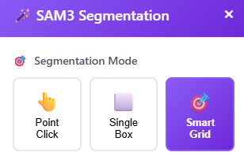
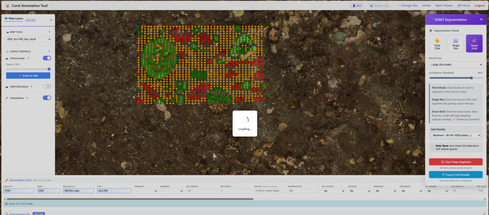
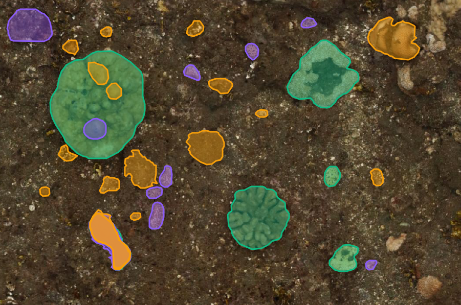

# CAT: Coral Annotation Tool
<a href="https://github.com/MichaelAkridge-NOAA/cat" target="_blank"></a>
  **C**oral **A**nnotation **T**ool — Docker-deployed, Oracle-backed Structure from Motion (SfM) orthomosaic coral reef annotation and project management system.

> **Branch:** `cat_db` — Oracle database backend with auto-bootstrap.  
> For the lightweight, file-based version see the [`main` branch](https://github.com/MichaelAkridge-NOAA/cat).

### About

**CAT** is an annotation and visualization platform designed for marine scientists working with Structure from Motion (SfM) orthomosaic imagery. This branch adds an **Oracle database backend** for centralized project management, persistent annotations, overlay layer support, and multi-user workflows — all deployed via Docker Compose.

On first startup the system auto-bootstraps: Oracle init scripts create the schema, and the CAT app ingests reference data from CSVs — no manual DDL required.

### Features
> ⚠️ **Note: Under Active Development**: CAT is under active development. Features are being added regularly and some functionality may change. See the [Roadmap](#roadmap) section for planned improvements.
### **Mapping & Visualization**
- **Fast Streaming** - Dynamic tile generation for instant viewing (ala google maps but for orthomoasics)
- **High Zoom Levels** - Zoom up to 2000x for pixel-level inspection
- **Multi-Layer Support** - Work with multiple orthomosaics simultaneously
- **Shapefile Overlay** - Import and visualize existing shapefile layers

### **Annotation Tools**
- **Vector Annotations** - Draw polygons, lines, and points with custom attributes
- **Species Database** - Built-in coral species reference (1000+ species)
- **Rich Metadata** - Capture depth, health, morphology, and custom attributes
- **Real-time Editing** - Modify annotations on-the-fly with visual feedback
- **Annotation Timer** - Track time spent on each annotation session

### **Project Management**
- **Oracle Database Backend** - Centralized project and annotation storage
- **Auto-Bootstrap** - Schema and reference data created on first startup
- **Shapefile Overlay Layers** - Import, edit, reorder, and style vector overlays per project
- **GeoJSON Export** - Export annotations in standard GeoJSON format
- **Drag & Drop Interface** - Easy project creation with multiple TIF files
- **Live Status Dashboard** - Homepage shows DB connection, project count at a glance

### **Cloud Optomized GeoTiff (COG) Processing** (https://github.com/MichaelAkridge-NOAA/sfm-orthomosaic-tile-viewer)
- **Batch Conversion** - Convert multiple GeoTIFFs to COG format simultaneously
- **One-Time Setup** - Automatic COG creation on first project load
- **Compression Options** - LZW, DEFLATE, or JPEG compression
- **Validation** - Built-in COG format validation

## Interface


## Quick Start (Docker + Oracle)

### Prerequisites
- Docker & Docker Compose (v2+)
- Git

### 1. Clone & Configure

```bash
git clone -b cat_db_v2 https://github.com/MichaelAkridge-NOAA/cat.git
cd cat

# Create your .env from the template and set passwords
cp .env.example .env
nano .env   # <-- change ORACLE_PASSWORD and APP_SCHEMA_PASSWORD
```

### 2. Start

```bash
docker compose -f docker-compose.cat.yml up -d --build
```

On first startup:
1. Oracle Free initializes and runs `scripts/db-init/*.sql` (creates schema + tables)
2. CAT app waits for Oracle, verifies schema, ingests reference CSVs
3. FastAPI server starts on **http://localhost:8000**

### 3. Verify

```bash
# Service status
docker compose -f docker-compose.cat.yml ps

# Health + config
curl http://localhost:8000/health
curl http://localhost:8000/api/config
```

### Google Cloud Workstation Deployment

For a full automated install (Docker, systemd auto-start, management scripts):

```bash
sudo bash install_cat.sh
```

See [docs/DEPLOYMENT_PLAN.md](docs/DEPLOYMENT_PLAN.md) for architecture details.

### Standalone / File Mode (no database)

CAT also works without Oracle for local, file-based workflows:

```bash
pip install coral-annotation-tool
cat   # starts server at http://localhost:8000
```

Or from source: `python main.py`
---

## Usage

### Creating Your First Project

1. **Open the Project Manager**
   - Navigate to http://localhost:8000
   - Click the **Project Manager** card (the primary action)

2. **Create a New Project** (Oracle mode)
   - Click **"Quick Create"** in the Oracle Projects panel
   - Fill in: Project Name, Site, Island, Year, Cruise, Observer
   - Add COG TIF file paths (GCS `gs://` URLs or local paths)
   - Click **Create Project**

3. **Add Overlay Layers** (optional)
   - Open a project and click **"Manage Layers"**
   - Upload shapefiles (ZIP or loose .shp/.shx/.dbf/.prj)
   - Toggle visibility, reorder, change colors, zoom to layer extent

4. **Start Annotating**
   - Click **"Open"** on any project to launch the annotation view
   - Draw polygons, lines, and points on the orthomosaic
   - Annotations save to Oracle automatically

### Annotation Workflow

1. **Select Drawing Tool**
   - 📍 Point - Individual coral colonies
   - ➖ Line - Transects or linear features
   - ⬜ Rectangle - Quick area selection
   - 🔷 Polygon - Complex coral formations

2. **Draw on Map**
   - Click to place vertices
   - Double-click to finish
   - Edit by dragging vertices

3. **Fill Annotation Form**
   - Species (autocomplete with 1000+ species)
   - Morphology, Health, Size
   - Depth, Coverage, Notes

4. **Save Annotation**
   - Press `Ctrl+S` or click Save
   - Annotations auto-sync to project JSON

5. **Export Results**
   - Download updated project JSON
   - Export GeoJSON and/or shapefile for GIS analysis in ArcGIs/QGIS

### Converting TIF to COG
This happens automatically when creating a project, but there is also an additional batch converter included. 
**Via Web Interface:**
1. Navigate to http://localhost:8000/converter
2. Drag & drop GeoTIFF files
3. Select compression type
4. Click "Convert to COG"

**Via Command Line:**

```bash
# Single file conversion
cat-convert input.tif output_cog.tif

# Batch conversion
cat-batch-convert input_folder/ output_folder/

# Or use the Python scripts directly
python scripts/make_cog.py input.tif output_cog.tif
python scripts/make_cog_batch.py input_folder/ output_folder/
```

---

## Annotation Information & Data Format

Annotations are stored in GeoJSON format within project JSON files:
- [Data Dictionary](https://www.fisheries.noaa.gov/inport/item/63239)
- [Metadata](https://www.fisheries.noaa.gov/inport/item/63097)

```json
{
  "type": "Feature",
  "geometry": {
    "type": "Polygon",
    "coordinates": [[[lon1, lat1], [lon2, lat2], ...]]
  },
  "properties": {
    "id": "unique-id",
    "analyst": "Observer Name",
    "spcode": "PLOB",
    "scientific_name": "Porites lobata",
    "obs_year": 2025,
    "mission_id": "SE1902",
    "site": "KAH-608",
    "depth_m": 10.5,
    "health": "H",
    "morph_code": "MD",
    "notes": "Large colony with good coverage",
    "annotation_time_seconds": 45.2
  }
}
```

---

## Coral Species Database

CAT includes a comprehensive coral species reference database with:
- **1000+** coral species
- Scientific names (Genus + Species)
- Common 4-letter species codes
- Autocomplete search functionality
- NOAA coral identification standards

Located in: `data/reference/list_of_coral.csv`

---

## Roadmap
<a href="./docs/example_ai_0.png" target="_blank"></a>

### ✅ Completed (this branch)
- **Oracle Database Backend** - Centralized project, annotation, and session storage
- **Google Cloud Storage (GCS) Integration** - Native `gs://` bucket paths for COG imagery
- **Cloud Workstation Support** - Docker Compose deployment with auto-bootstrap
- **Shapefile Overlay Layers** - Import, edit, reorder, style, and persist vector overlays
- **Geometry Editing** - Double-click to edit overlay features, auto-save to Oracle
- **Live Status Dashboard** - Homepage shows DB health, project count

### 🚧 In Progress
- **AI-Assisted Annotation** - Automated and semi-automated coral detection, segmentation and classification (YOLO, SAM3)
- **Multi-user Support** - Shared annotation sessions with user tracking
<a href="./docs/example_ai_01.png" target="_blank"></a>

<a href="./docs/example_ai_02.png" target="_blank"></a>

### 📋 Planned Features

#### Cloud & Collaboration 
- **Enhanced COG Processing** - Improved batch conversion with progress tracking
- **Other Cloud Storage Integrations** - Support for AWS S3, Azure Blob Storage
- **Real-time Sync** - Live collaboration and annotation syncing

#### Analysis & Visualization
- **Statistics Dashboard** - Project-level analytics and reporting
- **Time-series Analysis** - Multi-temporal change detection
- **Export Formats** - Additional formats (KML, GeoPackage, CSV)

#### Advanced Features 
- **3D Support** - Integration with 3D reef models and point clouds

### 💡 Feature Requests
Have an idea? [Open an issue](https://github.com/MichaelAkridge-NOAA/cat/issues) with the `feature-request` label!

----------
#### Disclaimer
This repository is a scientific product and is not official communication of the National Oceanic and Atmospheric Administration, or the United States Department of Commerce. All NOAA GitHub project content is provided on an ‘as is’ basis and the user assumes responsibility for its use. Any claims against the Department of Commerce or Department of Commerce bureaus stemming from the use of this GitHub project will be governed by all applicable Federal law. Any reference to specific commercial products, processes, or services by service mark, trademark, manufacturer, or otherwise, does not constitute or imply their endorsement, recommendation or favoring by the Department of Commerce. The Department of Commerce seal and logo, or the seal and logo of a DOC bureau, shall not be used in any manner to imply endorsement of any commercial product or activity by DOC or the United States Government.

#### License
This repository's code is available under the terms specified in [LICENSE.md](./LICENSE.md).

## Acknowledgments
- This project uses [TiTiler](https://github.com/developmentseed/titiler) by Development Seed for dynamic tile generation. TiTiler is licensed under the [MIT License](https://github.com/developmentseed/titiler/blob/main/LICENSE).
- [pyshortcuts](https://github.com/newville/pyshortcuts)
