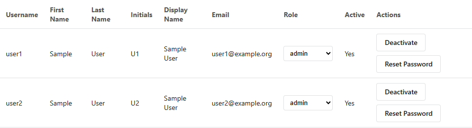

# Administrator Guide

**Required account role:** Administrator.

CAT administrators manage application users and deployment-wide roles. This page does not cover Oracle accounts or infrastructure administration.

## Review users

1. Open **User Administration**.
2. Locate the user by username, display name, or email shown in the table.
3. Confirm the current **Role** and **Active** status.
4. Verify the person's authorization before making a change.

{ loading=lazy }

## Change an account role

1. Select the required role in the user's **Role** control.
2. Wait for the update confirmation.
3. Ask the user to refresh or sign in again before testing access.

Assign **Team Lead** only to people responsible for deployment-wide annotation configuration. Assign **Administrator** only to people authorized to manage accounts.

## Activate or deactivate an account

1. Select **Deactivate** to block an active account, or **Activate** to restore it.
2. Confirm the row reflects the new state.
3. Record the change according to your access-management procedure.

Deactivation prevents account use but does not remove projects or annotations previously created by that user.

## Reset a password

1. Select **Reset Password** for the correct user.
2. Enter a temporary password containing at least eight characters.
3. Communicate it through an approved secure channel.
4. Instruct the user to sign in and change it immediately under **Preferences**.

!!! warning "Verify identity"
    Confirm the user's identity before resetting credentials. Never place passwords in tickets, documentation screenshots, or ordinary email.

## Project access

Administrator status does not automatically grant access to every project. Project owners manage collaborators through **Share**. Use that workflow instead of changing database records directly.