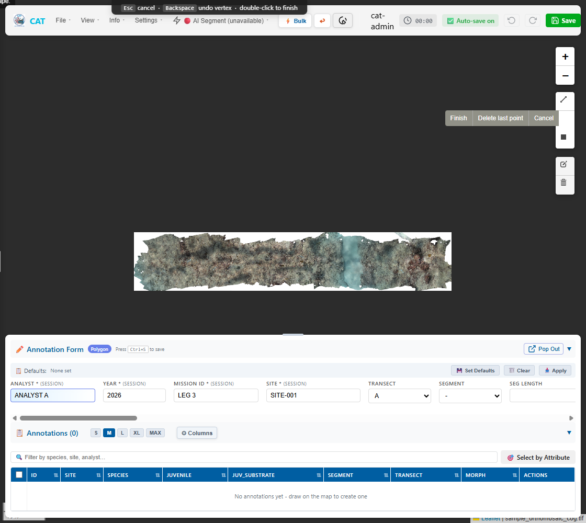
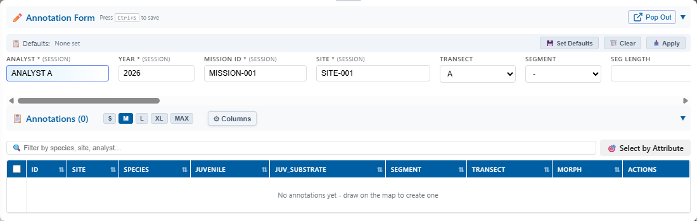

# Annotation Basics

Use the annotation viewer to draw features over project imagery and attach coral observation data.

**Required project access:** Owner or Editor. Viewers can inspect but cannot save changes.

## Before annotating

1. Open the correct project from **Project Manager**.
2. Confirm the project name and imagery.
3. Wait for the map and existing annotations to finish loading.
4. Check that your analyst, site, mission, year, and other required values are correct.
5. Zoom to the feature at an appropriate inspection scale.

The top toolbar shows bulk mode, undo/redo, timer, auto-save status, manual save, and whether optional AI segmentation is available. A disabled **AI Segment (unavailable)** control means the segmentation service is not enabled for that deployment.

## Create an annotation

1. Select the appropriate drawing tool for the observation. CAT supports point, line, rectangle, and polygon geometry where enabled by the viewer.
2. Draw the feature on the map. For multi-vertex geometry, follow the drawing hint: `Esc` cancels, `Backspace` removes the last vertex, and double-click finishes.
3. Complete the annotation form. Required fields depend on the deployment configuration and may include species, morphology, transect, segment, juvenile status, substrate, and notes.
4. Review the geometry and fields.
5. Select **Save Annotation** or press `Ctrl+S`.
6. Wait for the saved confirmation and confirm that the record appears in the annotation table.

{ loading=lazy }

The annotation form can be collapsed or popped out. Its compact header keeps session fields, defaults, and the annotation table available while preserving map space.

{ loading=lazy }

!!! warning "Confirm database synchronization"
    A message such as **Saved locally, DB sync failed** means the shared database did not receive the change. Do not assume the annotation is durable; preserve the details and follow [Troubleshooting](troubleshooting.md).

## Edit annotation fields

1. Select the annotation on the map or locate it in the annotation table.
2. Choose **Edit Fields**.
3. Correct the values.
4. Save the changes and wait for confirmation.

## Edit geometry

1. Locate the annotation in the table.
2. Choose **Edit Geometry**.
3. Move the feature or its vertices as needed.
4. Complete the map edit action.
5. Confirm that the changed geometry remains after the project refreshes.

Use **Undo** (`Ctrl+Z`) and **Redo** (`Ctrl+Y`) for supported annotation operations. Their toolbar buttons remain disabled when no operation is available.

## Delete an annotation

1. Verify the colony or annotation identifier.
2. Select **Delete** for that record.
3. Confirm the deletion.
4. Check that the feature leaves both the map and table.

Deleted annotations are removed from the active project view. Contact the project owner or support promptly if a record was deleted by mistake.

## Finish work

1. Check the status indicator for unsaved or failed changes.
2. Select **Save** or **Save Project** when that control is shown.
3. Review incomplete records in the annotation table.
4. Leave the project only after pending saves complete.

CAT tracks annotation sessions automatically. Do not rely on the timer as evidence that every individual change synchronized successfully.