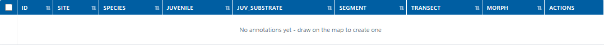
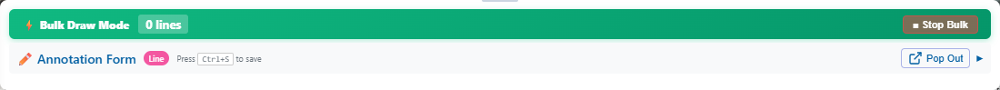
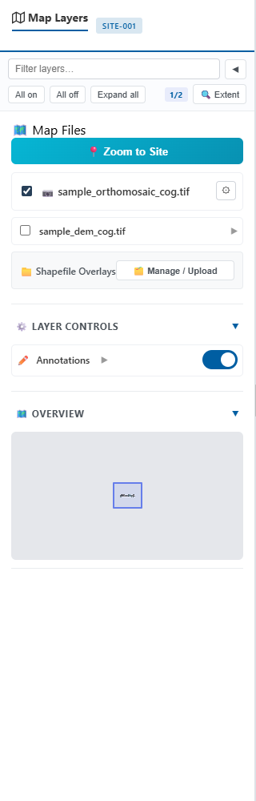
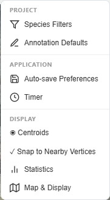

# Tables, Defaults, and Layers

These tools help editors work consistently across larger projects. Complete the [basic annotation workflow](annotation-basics.md) before using bulk operations.

**Required project access:** Owner or Editor for changes. Viewers can inspect available data.

## Review the annotation table

The annotation table lists records in the current project and highlights incomplete or unsynchronized work.

1. Open the annotation table in the viewer.
2. Filter or sort the rows to find the records you need.
3. Select a colony identifier to locate its feature on the map.
4. Use **Edit Fields**, **Edit Geometry**, or **Delete** on one record at a time.
5. Resolve incomplete records before QC and export.

Use the **S**, **M**, **L**, **XL**, and **MAX** controls to change table density, **Columns** to select visible fields, and **Select by Attribute** for targeted sets.

{ loading=lazy }

Editable table cells can update values directly. Confirm that each update reports a successful save before moving to another page.

## Use annotation defaults

Defaults pre-fill new annotations; they do not rewrite existing records.

1. Open **Preferences** > **Annotation Defaults**, or display the defaults bar in the annotation viewer.
2. Set only values that should repeat across the upcoming annotations.
3. Capture or save the defaults.
4. Start a new annotation and verify the pre-filled values.
5. Clear or replace a default as soon as the work context changes.

Defaults captured in the annotation viewer override account-level defaults in that browser. Team-lead deployment defaults are used only when a more specific default is not set.

!!! warning "Recheck changing fields"
    Do not default values such as species, morphology, or transect when they vary between observations. A convenient default can create systematic data errors.

## Apply bulk changes

Bulk tools apply one value to multiple selected annotations.

1. Filter the table so the intended records are easy to identify.
2. Select the records to change.
3. Choose the bulk field and value.
4. Review the selection count and proposed value.
5. Apply the change.
6. Inspect several affected rows and confirm database synchronization.

Use a bulk operation only when every selected record should receive the same value. If the selection is uncertain, edit records individually.

The toolbar **Bulk** control starts a line-oriented bulk draw mode. The form displays the number of captured lines and a **Stop Bulk** control. Draw the intended geometries, stop bulk mode, then complete and verify their attributes before leaving the project.

{ loading=lazy }

## Work with overlay layers

Overlay layers provide reference features separate from coral annotations.

1. Open **Layers** > **Manage Overlay Layers** or show the layers sidebar.
2. Toggle a layer to compare it with the project imagery.
3. Adjust supported display settings without obscuring annotation geometry.
4. If authorized, use **Upload Shapefile Overlay** to add the complete set of required shapefile components.
5. Confirm the layer alignment and coordinate reference information before using it as an annotation reference.

The sidebar provides **All on**, **All off**, **Expand all**, extent, COG/DEM visibility, raster settings, shapefile management, annotation visibility, opacity, line width, labels, and an overview map.

{ loading=lazy }

Overlay features are not coral annotations and do not appear as annotation records unless explicitly converted through a supported workflow.

## Configure the workspace

Open **Settings** for project species filters, annotation defaults, auto-save preferences, timer controls, centroid display, snapping, statistics, and map/display settings.

{ loading=lazy }

Use **View** to change visible panels and map presentation. Use **File** for save/export and layer commands. Confirm the auto-save badge before relying on automatic persistence; use the manual **Save** control when required by your workflow.