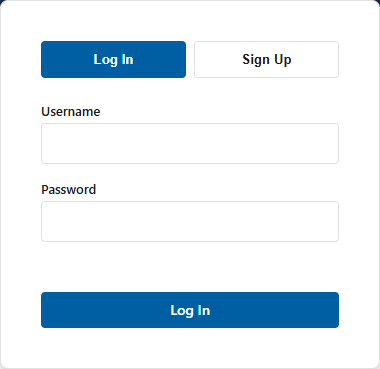
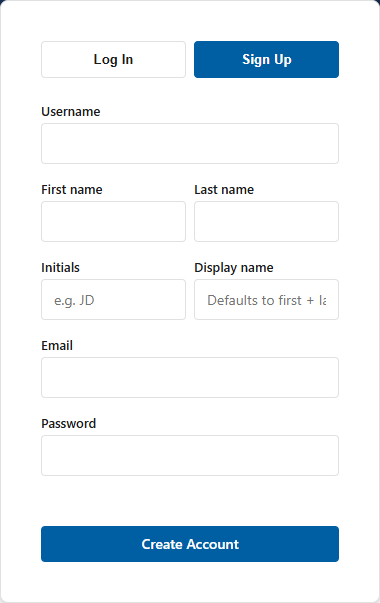

# First Login

This procedure starts at the web address supplied by your CAT administrator.

!!! note "Database edition only"
    A database-edition session requires a CAT account. Local file-mode projects do not use this sign-in workflow.

## Sign in

1. Open the CAT web address in a supported browser.
2. On the **Log In** tab, enter your username and password.
3. Select **Log In**.
4. Confirm that the CAT home page opens and the database status is available.

{ loading=lazy }

If your deployment permits self-registration, use the sign-up tab and complete the requested name, username, email, and password fields. A password must contain at least eight characters. An administrator may still need to activate the account or assign an elevated role.

{ loading=lazy }

## Open the project manager

1. From the CAT home page, select **Open Project Manager**.
2. Review the projects available to your account.
3. Check the access badge for the project:
   - **Owner**: you own and manage the project.
   - **Editor**: you can change project data and annotations.
   - **View only**: you can inspect the project but cannot change it.
4. Open the required project in the viewer.

If a project is missing, ask its owner to add your username as a collaborator. Administrators do not automatically become collaborators on every project.

## End a session

Use the account menu to log out when working on a shared computer. Closing a tab is not a substitute for logging out.

## Next steps

- Read [Roles and access](roles-and-access.md) before sharing or changing a project.
- Follow [Projects](projects.md) to create or collaborate on a project.
- Follow [Annotation basics](annotation-basics.md) when the imagery is ready.