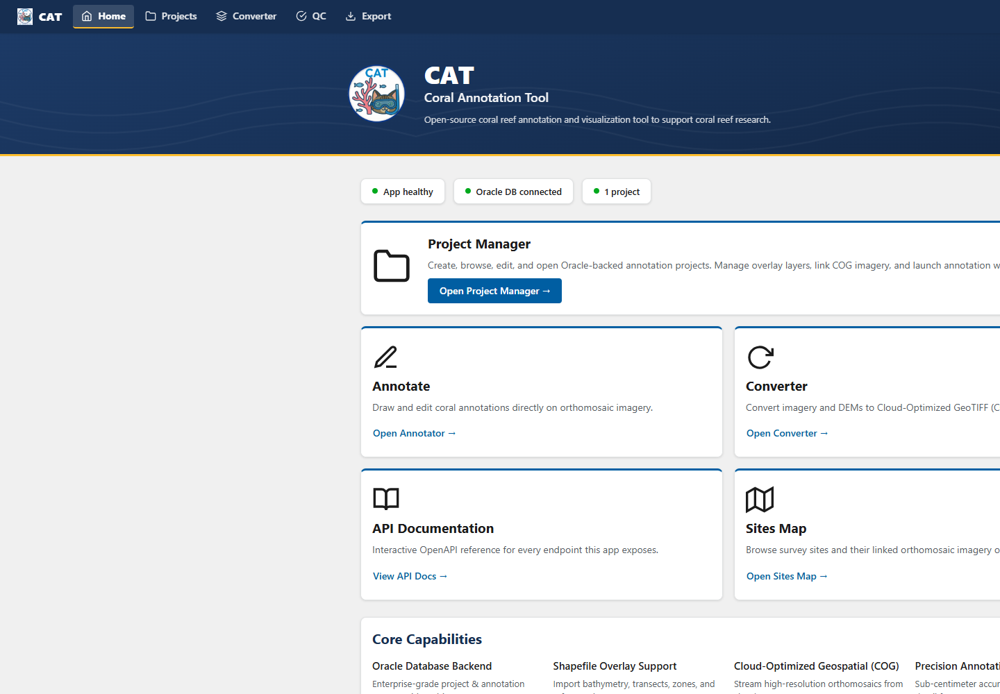

# CAT Database Edition User Guide

This guide explains how to use the shared, database-backed edition of the **Coral Annotation Tool (CAT)**. It is for annotators, team leads, and administrators working in an existing CAT deployment.

!!! note "Database edition only"
    These procedures apply when CAT uses its Oracle database backend. They do not apply to the local JSON project workflow described in the repository's main README.

{ loading=lazy }

## Choose your task

| Task | Start here |
| --- | --- |
| Sign in and find your way around | [First login](getting-started.md) |
| Understand what you can view or change | [Roles and access](roles-and-access.md) |
| Create, open, share, or copy a project | [Projects](projects.md) |
| Draw and save coral annotations | [Annotation basics](annotation-basics.md) |
| Review annotations in a table or use defaults | [Tables, defaults, and layers](annotation-tools.md) |
| Check quality, create a report, or download data | [Review and export](review-and-export.md) |
| Change your account settings | [Preferences](preferences.md) |
| Configure species and annotation fields | [Team lead guide](team-lead.md) |
| Manage users and roles | [Administrator guide](admin.md) |

## Standard workflow

1. Sign in to CAT.
2. Open an existing project or create a project.
3. Confirm that you have **Owner** or **Editor** access before changing data.
4. Open the project in the annotation viewer.
5. Draw a feature, complete its fields, and save the annotation.
6. Review the annotation table and correct incomplete records.
7. Use the QC dashboard and project report before exporting data.

CAT saves shared project data to the database. Changes made by authorized users can affect everyone with access to the project.

## Conventions in this guide

- **Bold text** names a control or page in CAT.
- A warning marks an action that affects shared data or other users.
- Role requirements appear at the beginning of restricted procedures.
- Screens can vary slightly as CAT is updated. Follow the visible control label if its position has changed.