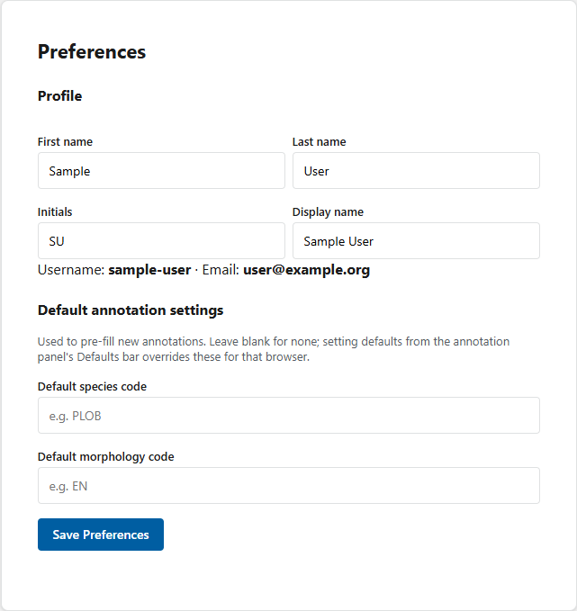
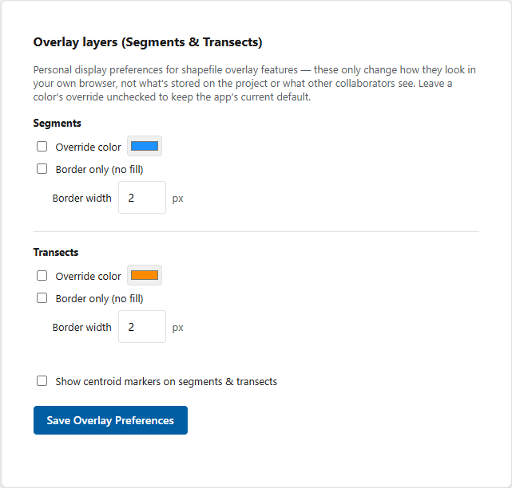

# Preferences

Preferences are stored with your CAT account and affect your annotation experience.

## Update your profile

1. Open **Preferences** from the account menu.
2. Review the profile fields shown for your account.
3. Update the permitted values.
4. Select **Save Preferences**.
5. Wait for the success message before leaving the page.

## Set account annotation defaults

1. Under **Default annotation settings**, enter a default species code or morphology code only when appropriate for your normal workflow.
2. Leave a field blank when no account-wide default is appropriate.
3. Select **Save Preferences**.
4. Open a project and start a new annotation to confirm the values.

{ loading=lazy }

Defaults set from the annotation viewer's defaults bar override these account values in that browser.

## Set overlay preferences

Use the overlay section to control supported visual defaults for shapefile features. These settings change how reference layers appear for your account; they do not alter the underlying layer geometry.

1. Adjust the available overlay display settings.
2. Select **Save Overlay Preferences**.
3. Refresh an annotation project and inspect a known overlay.

{ loading=lazy }

## Change your password

1. Enter your current password.
2. Enter a new password containing at least eight characters.
3. Select **Change Password**.
4. Confirm the success message.
5. Use the new password at your next login.

Do not reuse a password from another service. Contact an administrator if you cannot authenticate with the current password.