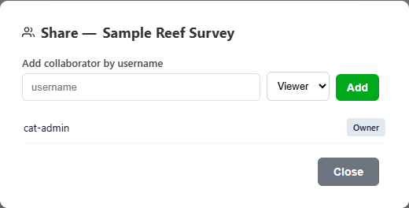
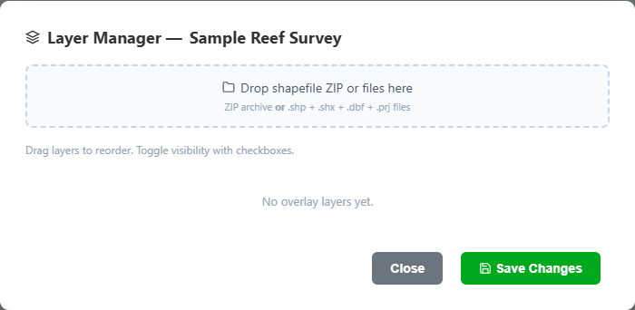

# Projects

Projects group imagery, annotations, overlay layers, metadata, and collaborators in the CAT database.

## Create a project

**Required access:** any active account.

1. Open **Project Manager**.
2. Select the database project creation option.
3. Complete the project name and the available project metadata.
4. Add the imagery source requested by your deployment.
5. Review the values before selecting **Create Project**.
6. After creation succeeds, open the project in the viewer.

Use only approved imagery locations. Do not place database credentials, access tokens, or private connection strings in project metadata.

## Open a project

The project manager separates projects you own from projects shared with you. Each shared project displays your access level.

{ loading=lazy }

1. Locate the project by name and metadata.
2. Check whether the badge says **Owner**, **Editor**, or **View only**.
3. Open the project.
4. Confirm that the expected imagery loads before annotating.

## Share a project

**Required access:** project owner.

1. Select **Share** for the project.
2. In **Add collaborator by username**, enter the exact CAT username.
3. Choose **Viewer** or **Editor**.
4. Select **Add**.
5. Confirm that the collaborator appears in the list with the intended role.

{ loading=lazy }

From the same dialog, an owner can change a collaborator's role or select **Remove** to revoke access.

!!! warning "Shared edits"
    Editors change the original project. Their annotation, layer, and asset changes are visible to other collaborators.

## Duplicate a project

Use **Duplicate** when you need an independent copy. Viewers can use this to make an editable project without changing the source.

1. Select **Duplicate** on the source project.
2. Enter a distinct name for the copy.
3. Confirm the action.
4. Open the copy under your projects and verify its imagery, annotations, and layers.

The duplicate is a separate project. Later changes do not synchronize between the source and copy.

## Manage project overlay layers

**Required access:** project owner or editor.

1. Select **Layers** on the project card.
2. Drop a shapefile ZIP, or provide its `.shp`, `.shx`, `.dbf`, and `.prj` components.
3. Reorder or toggle imported layers as needed.
4. Select **Save Changes** only after confirming the intended project.

{ loading=lazy }

## Delete a project

**Required access:** project owner.

1. Confirm that exports or required copies have been completed.
2. Select the project's delete action.
3. Verify the project name and ID in the confirmation message.
4. Confirm deletion only when you intend to permanently remove the project.

Deletion cannot be undone through the CAT interface.