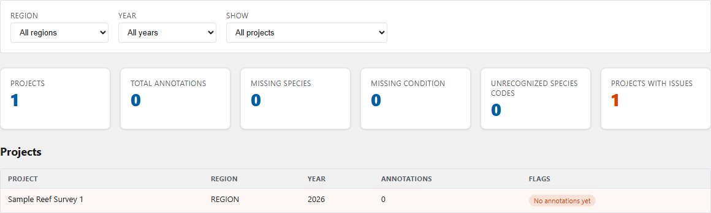
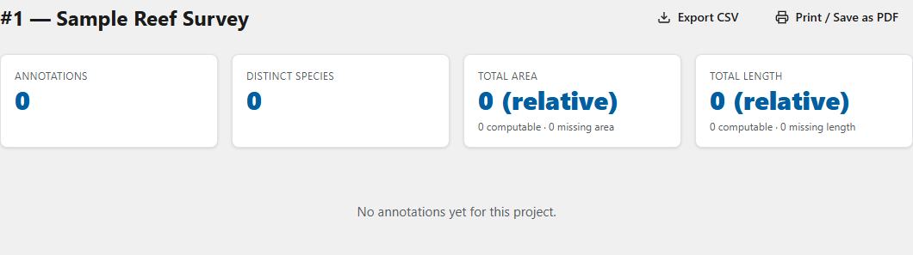
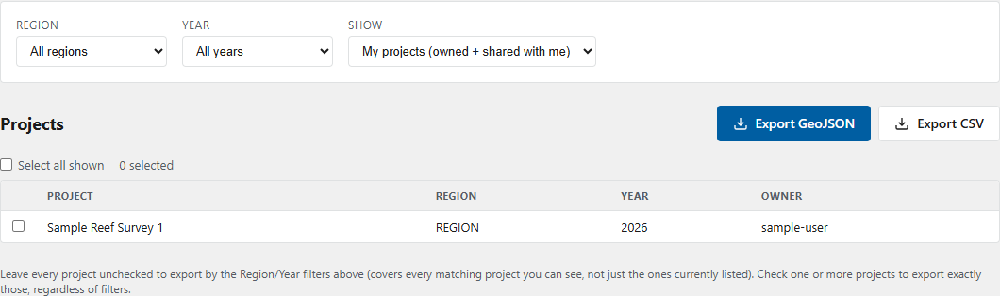

# Review and Export

Complete quality review before distributing CAT data. The database edition provides a cross-project QC dashboard, project reports, and filtered exports.

## Review the QC dashboard

1. Open **QC Dashboard** from CAT navigation.
2. Set **Region** and **Year** filters when needed.
3. Review the summary counts.
4. In the project table, examine each issue flag and annotation count.
5. Select a project name to open its report.
6. Return to the annotation viewer to correct source records, then refresh QC.

{ loading=lazy }

**No issues** means the configured checks did not find a problem. It does not replace scientific review of geometry or classification.

## Read a project report

The project report summarizes annotations by fields such as species and morphology and identifies missing values.

1. Open the report from the QC dashboard or project navigation.
2. Confirm the project title before interpreting results.
3. Review annotation totals, distinct species, area or length summaries, and grouped counts.
4. Review **Missing fields** and correct source annotations as required.
5. Use the report's **Export CSV** action when a tabular report summary is needed.

{ loading=lazy }

Values that cannot be calculated are reported separately. Do not treat missing area or length as zero.

## Export annotation data

1. Open **Export Data**.
2. Choose the access scope available to your role.
3. Filter by **Region** and **Year** as needed.
4. Select one or more projects and verify the selected count.
5. Choose **GeoJSON** for spatial feature exchange or **CSV** for tabular analysis.
6. Download the export and open it in the intended analysis tool.
7. Verify project IDs, record counts, coordinate handling, and required fields before distribution.

{ loading=lazy }

Exports contain the data visible to your account at the time of download. Re-export after corrections; existing downloaded files do not update automatically.

!!! warning "Protect project data"
    Exports may include analyst names, mission identifiers, site information, notes, and geometry. Store and share them according to your organization's data policy.