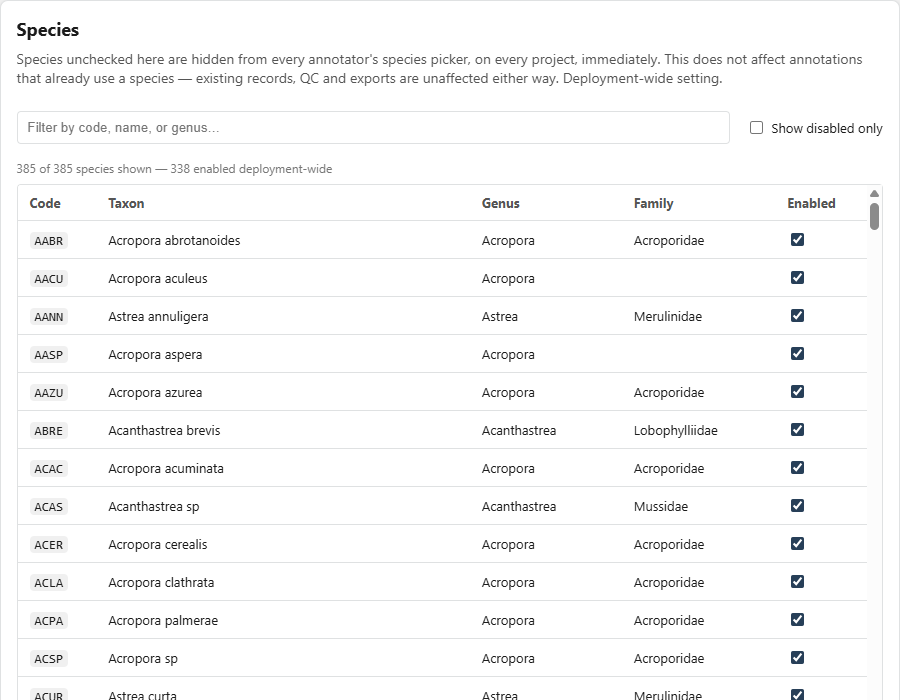
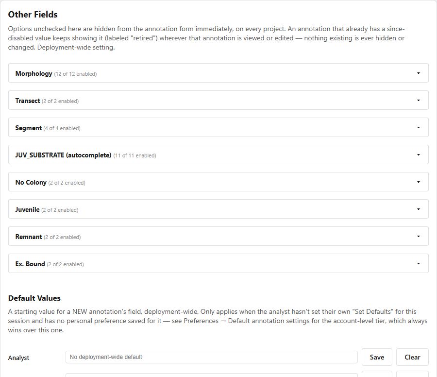

# Team Lead Guide

**Required account role:** Team Lead or Administrator.

The **Species & Fields** page controls deployment-wide annotation choices. Changes affect all projects and annotators using the deployment.

## Enable or disable species

1. Open **Species & Fields** and select the **Species** tab.
2. Search by code, name, or genus.
3. Use **Show disabled only** to review retired choices.
4. Select or clear **Enabled** for the species.
5. Confirm the status message.

{ loading=lazy }

Disabled species are hidden from new selection but remain on existing annotations, QC results, and reports.

## Initialize the species table

If the page reports that the species table is empty, select **Import species from reference CSV** once. Review the inserted and updated counts after completion. Do not repeat the import merely to refresh the page.

## Manage other fields

1. Select the **Other Fields** tab.
2. Expand the field to configure.
3. Enable or disable the required options.
4. Add an option only when it conforms to the project's data standard.
5. Confirm the saved status and test the annotation form.

{ loading=lazy }

Configurable fields include morphology, transect, segment, juvenile substrate, colony status, juvenile status, remnant status, and boundary status.

Disabling an option prevents new selection but does not rewrite an annotation that already contains that value.

## Set deployment defaults

1. Under **Default Values**, find the field.
2. Enter the value that should be proposed for users without a more specific default.
3. Save the change.
4. Test with an account that has no account or browser default for that field.

!!! warning "Deployment-wide effect"
    Announce configuration changes to annotators before they begin a work session. Record the reason and effective date according to your team's change-control practice.